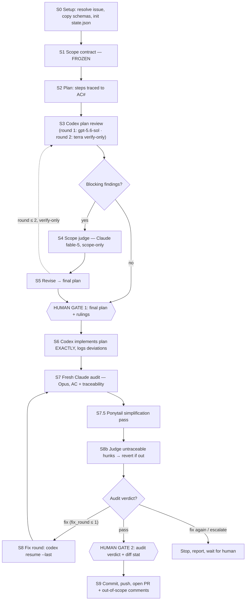

# loopzo

`loopzo` is a Claude Code plugin for turning GitHub issues into tightly scoped pull
requests. It ships two skills:

- **`issue-loop`** — the pipeline. One issue in, one scoped PR out. Keeps planning,
  implementation, scope judgment, and auditing in separate model sessions, persists state
  in files, caps review rounds, and pauses at two human gates.
- **`queue`** — the unattended drainer. Pulls the next labeled issue and runs `issue-loop`
  on it with the gates skipped. Designed to be the body of Claude Code's `/loop` command,
  so one `/loop /loopzo:queue` works through an entire backlog.

It works with any repository, but deliberately relies on a specific multi-CLI toolchain.

## Install

Run these commands inside Claude Code:

```text
/plugin marketplace add paarangat/loopzo
/plugin install loopzo@loopzo
```

Then start a run:

```text
/loopzo:issue-loop <issue# or URL> [repo-path]
```

Resume after a human gate or opt into unattended execution:

```text
/loopzo:issue-loop resume [run-dir]
/loopzo:issue-loop <issue# or URL> --auto
```

Plugin skills are namespaced, so `/loopzo:issue-loop` is the supported invocation. The
plugin does not provide a short `/issue-loop` alias; that command resolves only when a
separate standalone copy of the skill is installed.

## Prerequisites

Install and authenticate the required CLIs before starting a run:

- `codex` — OpenAI Codex CLI
- `claude` — Claude Code CLI
- `gh` — GitHub CLI
- `jq`

The default routing assumes access to `gpt-5.6-sol` and `gpt-5.6-terra` through Codex,
and `claude-fable-5`, `claude-opus-4-8`, and `claude-haiku-4-5-20251001` through Claude
Code. Model names change over time; replace them in `skills/issue-loop/SKILL.md` with
models available to your account, using the lower-cost fallbacks documented in the table.

The optional `ponytail:ponytail-review` skill adds a dedicated simplification pass. If it
is not installed, `issue-loop` applies the same checks itself.

## How the loop works

Each box below is a separate, single-purpose model session; state passes between them
through files in the run directory, never through chat.



Round caps (2 reviews, 1 fix, 1 arbiter) bound every cycle; hitting a cap stops the run
and hands back to the human rather than looping.

## Draining a backlog: `/loopzo:queue`

`issue-loop` runs one issue and stops twice for a human. `queue` is for when you have a
pile of issues and nobody watching: each invocation dequeues ONE ready issue and runs
`/loopzo:issue-loop <n> --auto` on it — gates skipped, because a loop tick has no human
present. Repetition comes from wrapping it in `/loop`, not from the skill itself.

The queue is two GitHub labels, so it needs no state files and survives across machines:

| Label | Meaning |
|---|---|
| `loopzo-ready` | Enqueued: eligible to be worked |
| `loopzo-done` | Claimed: never picked up again |

One-time setup per repo, then enqueue issues:

```text
gh label create loopzo-ready --color 0E8A16 --description "queued for /loopzo:queue"
gh label create loopzo-done  --color 5319E7 --description "claimed by /loopzo:queue"
gh issue edit <n> --add-label loopzo-ready    # repeat per issue you want worked
```

Run it:

```text
/loopzo:queue            # process the single next ready issue, then stop
/loop /loopzo:queue      # drain the backlog self-paced; stops when the queue is empty
/loop 30m /loopzo:queue  # standing drainer: check for new ready issues every 30 minutes
```

Behavior to know before looping it:

- **Lowest issue number first**, skipping anything already labeled `loopzo-done`.
- **Claim-before-work:** the `loopzo-done` label is added *before* the pipeline runs, so a
  crash mid-run can leave a stuck issue (remove the label by hand to requeue) but can
  never produce a duplicate PR. That is the cheaper direction to fail in.
- **Unattended means unattended:** every drained issue ends in a commit, push, and open
  PR with no approval step. If you want the two human gates, run
  `/loopzo:issue-loop <n>` directly instead — gates and looping are mutually exclusive.
- **Self-terminating:** an empty queue ends the `/loop` rather than polling forever.

## Model routing

| Stage | Default route | Effort |
|---|---|---|
| Scope and plan | Current Claude Code session | Session default |
| Plan review | Codex `gpt-5.6-sol` | Medium |
| Verify-only review | Codex `gpt-5.6-terra` | Low |
| Scope judge | Claude `claude-fable-5` | Low |
| Implementation | Codex `gpt-5.6-sol` | Medium |
| Fresh code audit | Claude `claude-opus-4-8` | Medium |
| Rare escalation | Claude `claude-opus-4-8` | High |

The loop is bounded to two plan-review rounds, one implementation-fix round, and one
arbiter call. Unless `--auto` is set, it stops for approval twice:

1. Gate 1 presents the reviewed final plan before implementation.
2. Gate 2 presents the audit verdict and diff summary before commit and PR creation.

## License

MIT © 2026 Paarangat. See [LICENSE](LICENSE).
